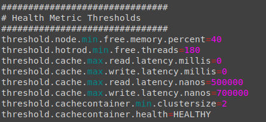
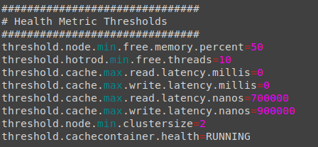
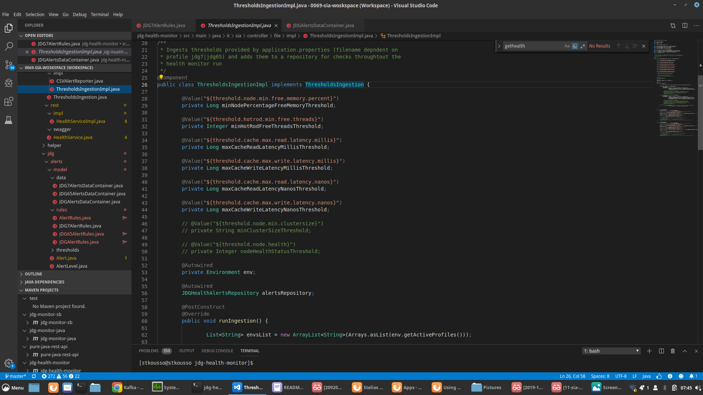
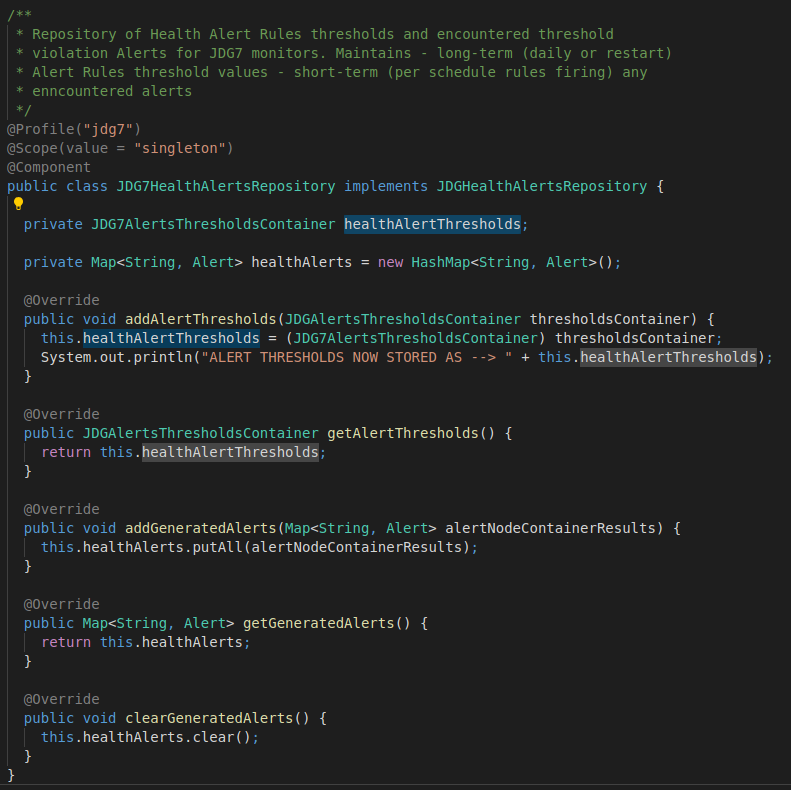
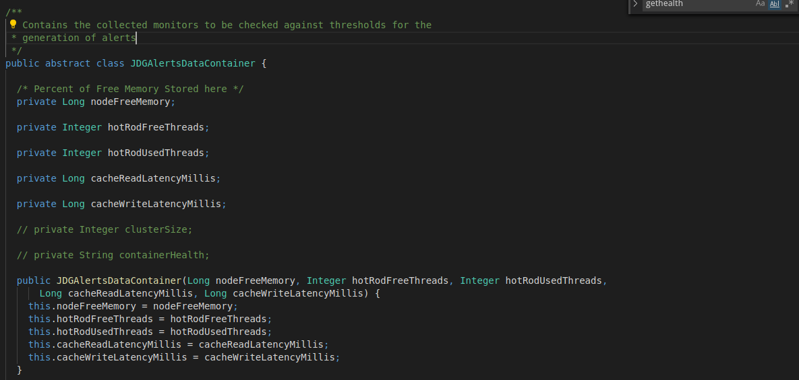
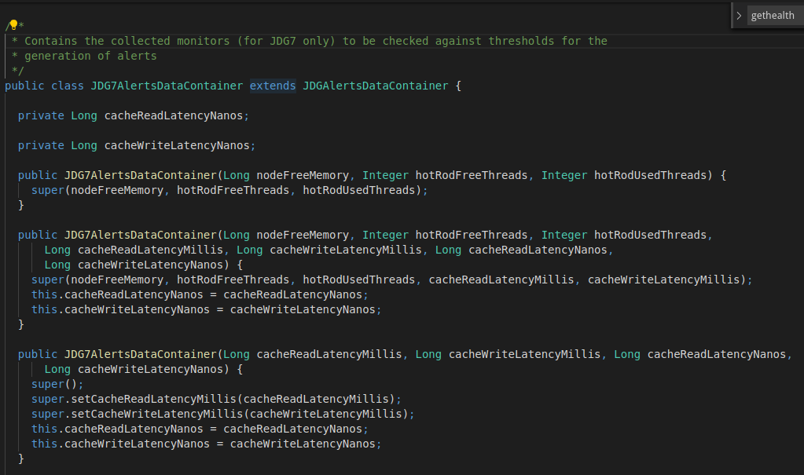
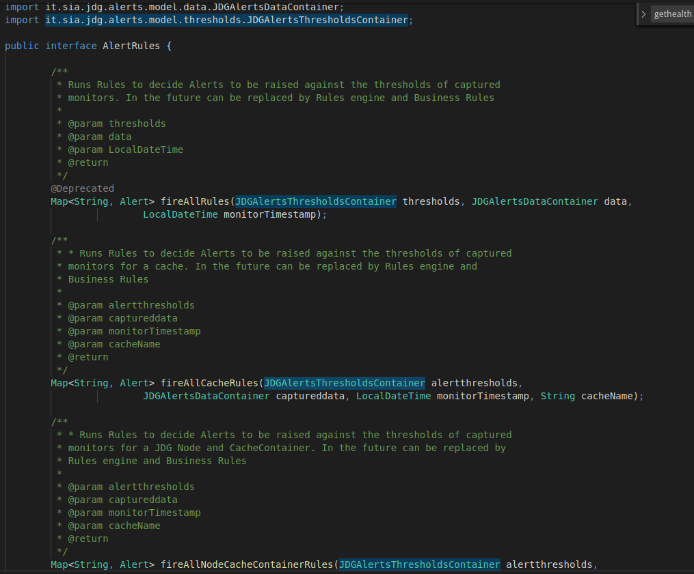
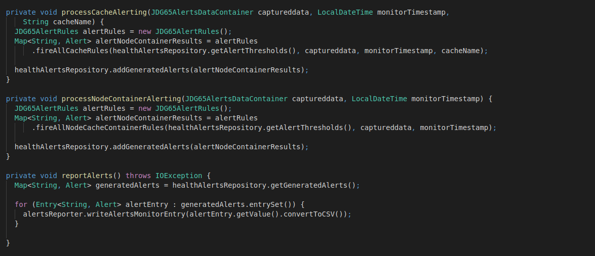

# How Alerts work (Adding a new alert)

1. Define new thresholds in _application.properties_ files
 

2. Define new member variables in _ThresholdIngenstionImpl.java_ for the ingestion of the thresholds

3. Just know that the thresholds end-up in _JDG7HealthAlertsRepository.JDG7HealAlertsThresholdContainer_ (and the equivalent classes for JDG65)

4. The threshold containers will require to be updated

5. Implement the rule in the correct category to fire (Implement in _JDGAlertRules.java_ for common, _JDG7AlertRules.java_ for JDG7 only, _JDG65AlertRules.java_ for JDG6 only)

6. Apply rules and collect Alerts in _CacheContainerHealthJDG6.runMonitor()_ (or _CacheContainerHealthJDG7.runMonitor()_)

